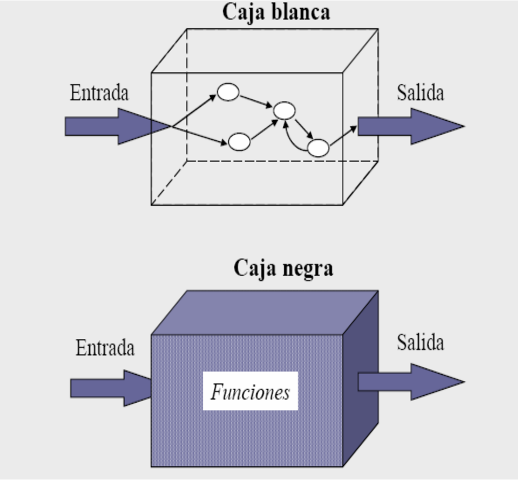

# Diseño y realización de pruebas


## Introducción


En esta Unidad aprenderemos a:

- Identificar los diferentes tipos de pruebas.
- Definir casos de prueba.
- Efectuar pruebas unitarias de clases y funciones.
- Efectuar pruebas de integración, de sistema y de aceptación.
- Realizar medidas de calidad sobre el software desarrollado.


### Objetivos de las pruebas

Pruebas de software: Son un conjunto de actividades que se realizan para saber si es correcto el comportamiento del software.

- Una buena prueba debe centrarse en dos objetivos: 

 1. probar si el software no hace lo que debe hacer
 2. probar si el software hace lo que no debe hacer.

- Existen distintos **frameworks** para la realización de pruebas.


### Framework

- Framework (entorno de trabajo) es un conjunto de conceptos, prácticas y criterios para enfocar un tipo de problemática particular que sirve como referencia, para enfrentar y resolver nuevos problemas de índole similar.
- Es un esquema (un esqueleto, un patrón) para el desarrollo y/o la implementación de una aplicación.

- En general, un framework (marco de trabajo) está compuesto por:

  - un conjunto de las mejores prácticas y suposiciones
  - herramientas comunes
  - bibliotecas 

- Permite unificar el proceso de desarrollo entre desarrolladores.


## Pruebas


### Forma de las pruebas

- __Pruebas dinámicas:__
Requieren la ejecución de la aplicación. Permiten medir el comportamiento de la aplicación desarrollada.

- __Pruebas estáticas:__
Se realizan sin ejecutar el código de la aplicación. Se examina o inspecciona el código fuente.


### Estrategias de prueba

(otro tipo de clasificar las pruebas)

- __Caja negra:__
Se estudia el sistema desde fuera. Son pruebas funcionales. No vemos lo que hay dentro, sólo vemos la funcionalidad, el resultado que muestra.

- __Caja blanca o transparente:__
Se examina el código fuente y su ejecución. Son pruebas estructurales. Vemos la estructura del código y si está funcionando correctamente.


### Estrategias de prueba




### Estrategias de prueba de caja negra

- Se estudia el sistema desde fuera, entendiendo qué es lo que hace, pero sin darle importancia a cómo lo hace.
- Se trabaja sobre la interfaz. Llamamos al método y vemos el resultado sin saber los detalles de funcionamiento.
- No se tienen en cuenta los detalles internos de funcionamiento.
- Se proporcionan entradas y se estudian las salidas.
- __Principales técnicas:__
  - __Particiones de equivalencia:__ Son técnicas que se utilizan para pruebas de caja negra. Probando por partes, por ejemplo en un método de suma de dos números enteros, probar con una partición dos números positivos, con otra partición dos números negativos, etc. Agrupar los casos de prueba en clases equivalentes u homogéneas.
  
  - __Valores límite:__ Utilizar valores límite para hacer las pruebas, es muy útil para ver si se cumplen los bucles.


### Estrategias de prueba de caja blanca

- Se examina el código fuente y su ejecución, para comprobar si está funcionando correctamente.
- Se comprueban los flujos de ejecución dentro de cada unidad (función, clase, módulo, etc.) 
- También pueden comprobarse los flujos entre unidades durante la integración. (por ejemplo, si se llama bien a sus métodos)
- E incluso entre subsistemas, durante las pruebas de sistema.
- __Principales técnicas:__
  - __Cobertura lógica o cobertura del código:__ Se comprueba que todos los caminos del código se ejecutan.  IMPORTANTE saber la diferencia entre las dos técnicas.
  - __Prueba de bucles:__ prueba específica de bucles para saber que están funcionando correctamente.


### Tipos de pruebas

- __Funcionales:__
Evaluan el cumplimiento de los requisitos. Que hace lo que se pide.

- __No funcionales:__
Evaluan aspectos adicionales como rendimiento, seguridad, ... (valora otros aspectos distintos, aunque funcione correctamente)


### Pruebas funcionales

- __Pruebas unitarias (o de unidad):__ Son las pruebas principales, es donde se prueban las clases y los métodos que tienen disponibles.(se verifica el código, que sea correcto el nombre, los parámetros, el tipo que devuelve...)
- __Pruebas de regresión:__ (regresión: cosas que antes funcionaban y ahora no). Las pruebas de regresión comprueban  el funcionamiento del software frente e a cambios que se hayan hecho. El propósito es asegurarse que casos de prueba que ya habían sido probados y fueron exitosos permanezcan así.
- __Pruebas de integración:__ pruebas para ver que al ejecutar el conjunto funciona correctamente.
- __Pruebas del sistema:__ suelen ser las no funcionales como rendimiento, seguridad.... junto con las pruebas de integración.
- __Pruebas de humo (smoke test):__ comprueban las funcionalidades y componentes básicos de una aplicación. son aquellas pruebas que pretenden evaluar la calidad de un producto de software previo a una recepción formal. Es una revisión rápida del producto de software para comprobar que funciona y no tiene defectos que interrumpan la operación básica del mismo
- __Pruebas alfa y beta:__ pruebas __"alfa"__ son pruebas de software realizadas cuando el sistema está en desarrollo y cuyo objetivo es asegurar que lo que estamos desarrollando es probablemente correcto y útil para el cliente. Son pruebas de producto pero se hacen en un entorno controlado dentro de la empresa y con cierto conocimiento de la aplicación.
Las pruebas __"beta"__ son las pruebas de software que se realizan cuando el sistema está teóricamente correcto y pasa a ejecutarse en un entorno real. Es la fase siguiente a las pruebas Alpha. Se hacen en un entorno no controlado (en la casa de cada cliente por ejemplo) se prueba la aplicación por parte del cliente.
- __Pruebas de aceptación (validación por parte del cliente):__ son las pruebas finales que se hacen con el usuario, para comprobar que todas los requisitos de la aplicación se cumplen y son validados.


### Pruebas no funcionales

- __Pruebas de usabilidad:__ que tenga buena interfaz y sea fácil de usar.
- __Pruebas de rendimiento:__ que tiene buen rendimiento.
- __Pruebas de stress:__ someter a una carga elevada la apliacación, cálculos, usuario....
- __Pruebas de seguridad:__ que no hay ningún agüjero de seguridad por ejemplo con los accesos a ciertos usuario.
- __Pruebas de compatibilidad:__ compatibilidad entre software o bibliotecas.
- __Pruebas de portabilidad:__ si es compatible con Linux o Windows etc...
- ...


### Mecanismos de prueba

- Manual
  - Mediante pruebas realizadas por personal de la empresa o externo.
- Automático
  - Mediante software que ejecuta código de forma automatizada y compara los resultados obtenidos y los resultados esperados.


### Soporte del depurador

- Puntos de ruptura: donde quieres que se pare el código.
- Ejecución paso a paso
- Análisis de variables


### Automatización de pruebas

- Frameworks de pruebas (xUnit)
- Aserciones

https://en.wikipedia.org/wiki/XUnit


### Frameworks para pruebas

- Java: JUnit, TestNG
- C++: CppUnit, Google Test
- PHP: PHPUnit
- Javascript: Mocha

https://en.wikipedia.org/wiki/List_of_unit_testing_frameworks


### Caso de prueba

- precondición --> postcondición
- Una entrada conocida  --> Una salida esperada 

http://www.jtech.ua.es/j2ee/publico/lja-2012-13/sesion04-apuntes.html


### JUnit4/5 - Anotaciones

- @BeforeClass / @BeforeAll
- @Before / @BeforeEach
- @Test
- @After / @AfterEach
- @AfterClass / @AfterAll
- @Ignore


### JUnit - Aserciones

```java
import org.junit.Test;
import static org.junit.Assert.*;

// ... 
fail()                         // el test termina con fallo
assertTrue(expresión)          // expresión es true ?
assertFalse(expresión)         // expresión es false ?
assertEquals(esperado,real)    // esperado es igual a real ?
assertNotEquals(esperado,real) // esperado es distinto de real ?
assertNull(objeto)             // objeto es null ?
assertNotNull(objeto)          // objeto es distinto de null ?

// objeto_esperado es igual a objeto_real ?
assertSame(objeto_esperado,objeto_real)
// objeto_esperado es distinto de objeto_real ?
assertNotSame(objeto_esperado,objeto_real)
```

http://junit.org/junit4/javadoc/4.12/org/junit/Assert.html


### TDD

- Desarrollo guiado por pruebas de software, o Test-Driven Development (TDD) 
  - Escribir las pruebas primero (Test First Development).
  - Refactorización (Refactoring).


## Integración


### Formas de integración

- Integración Big bang
- Integración Descendente
- Integración Ascendente
- Integración Continua (CI)


### Servidores de integración continua

> CI : Integración continua  
> CD : Despliegue continuo

- Jenkins
- Bamboo
- TravisCI
- CircleCI

Note: CI=Continuous Integration / CD=Continuous Delivery.


# Calidad


## Control de calidad

Control de calidad = medición de la calidad de un producto
--> Pruebas


## Calidad del proceso/producto (QA/QC)

- QA es un conjunto de actividades para garantizar la __calidad en los procesos__ mediante los cuales se desarrollan los productos. 
- QC es un conjunto de actividades para garantizar __la calidad de los productos__. Las actividades se centran en identificar defectos en los productos reales producidos.

Note: QA = Quality Assurance / QC = Quality Control


## Factores de calidad

- __Corrección:__ grado en que una aplicación satisface sus especificaciones y consigue los objetivos encomendados por el cliente. 
- __Fiabilidad:__ grado en el que el software es confiable, es decir, no tiene fallos.
- __Eficiencia:__ capacidad de producto software para proporcionar un rendimiento adecuado, relativo a la cantidad de recursos utilizados, bajo unas condiciones establecidas.
- __Seguridad:__ capacidad para alcanzar niveles aceptables de riesgo de daño para las personas, software, equipos o entorno en un contexto especificado de uso.
- __Facilidad de uso:__ facilidad con la cual personas de diferentes formaciones y aptitudes pueden aprender a usar la aplicación y aplicarlos a la resolución de problemas, cubre la facilidad de instalación, operación y supervisión.
- __Mantenibilidad:__ capacidad de un producto software para ser modificado. Las modificaciones pueden incluir correcciones, mejoras o adaptaciones del software a cambios en el entorno, en los requerimientos o las especificaciones funcionales.
- __Flexibilidad:__ capacidad de un producto para poder ser modificado.
- __Facilidad de prueba:__ es el esfuerzo requerido para probar una aplicación de forma que cumpla con lo especificado en los requisitos.
- __Transportabilidad:__ facilidad de transferir la aplicación a otro hardware o sistema operativo (de un entorno a otro).
- __Reusabilidad:__ capacidad de un producto de poder utilizar partes de él en otras aplicaciones.
- __Interoperatividad:__ capacidad de un producto de poder comunicarse con otras aplicaciones o sistemas informáticos.
