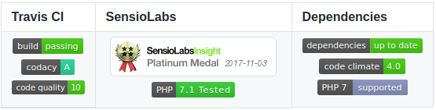

## Optimización y documentación

## Introducción


En esta Unidad aprenderemos a:

- Trabajar de forma habitual con un sistema de control de versiones.  
- Identificar los patrones de refactorización más usuales.
- Revisar el código fuente usando un analizador de código.
- Documentar el código fuente.


## Optimización


### Hediondez del código

- También llamado __code smell__ en inglés ( el programa funciona bien pero el código no está bien desarrollado y se puede mejorar el código)
- Es síntoma en el código fuente que indica posiblemente un problema más profundo.
- Usualmente no son bug de programación (errores): no son técnicamente incorrectos y en realidad no impiden que el programa funcione correctamente. 
- Indica deficiencias en el diseño que puede ralentizar el desarrollo o aumentan el riesgo de errores o fallos en el futuro.
- Es un motivo importante para realizar refactorización.
- [Hediondez del código](https://es.wikipedia.org/wiki/Hediondez_del_c%C3%B3digo)


### Análisis de código

- Tipos:
  - __Análisis dinámico__ (unit tests): analizar el funcionamiento del código.(los test unitarios)
  - __Análisis estático__ (__lint__): examinar el código fuente.


### Análisis estático de código

- Mediante analizadores estáticos (__linters__)
 - [Introducción a los linters -en inglés-](https://github.com/mcandre/linters)
- Mediante sitios web para inspección de código (__Continuous Inspection__) 


### Linters 

- Analizadores estáticos de código:

 - __lint__: C  
 - __sonar__: Java
 - __JSLint__, __ESLint__: Javascript 


### Continuous Inspection o Continuous Analysis

- Sitios web que ofrecen __inspección de código__:

 - __Scrutinizer__
 - __SonarQube__


#### Scrutinizer


- __PHP, Python y Ruby soportados__
- 14 días de prueba gratis
- Precio/Mes:
  - Plan Basic: 49 €
  - Plan Professional: 99 €
  - Plan Unlimited: 199 €

Note: A fecha Diciembre 2017


#### SonarQube

[  ](https://www.sonarqube.org/)

- __Más de 20 lenguajes soportados__
- Precio/Mes:
  - Plan Open Source: 0 $
  - Plan Private Projects: Desde 5 $ 

Note: A fecha Diciembre 2017


### Refactorización
 
- __Es el proceso de reestructurar un código fuente, alterando su estructura interna sin cambiar su comportamiento externo.__(el programa sigue haciendo lo mismo, pero hay que mejorarlo para que sea más legible y más eficiente)
- Técnicas:
  - Renombrado de variables
  - Pasar código duplicado a funciones
  - Eliminación de código inalcanzable (que no se llega a ejecutar nunca)
  - Eliminación de código redundante 
  - Eliminación de código muerto (código que no sirve para nada)
  - ...

[Artículo en Wikipedia](https://es.wikipedia.org/wiki/Eliminaci%C3%B3n_de_c%C3%B3digo_muerto)


## Documentación


### Insignias (badges)

[  ](https://shields.io/)

- Las insignias (badges): Para informar acerca del proyecto. Por ejemplo, cobertura de código.

### Tipos de documentación

- Documentación de código: el código documentado
- Documentación técnica: pdf o manual que hacemos para el administrador del programa
- Documentación de usuario


### Formatos de documentación

- **HTML** (p. ej. Javadoc)
  - Comentarios de línea //
  - Comentarios de bloque /* ... */
  - Comentarios Javadoc /** ...*/

- **Markdown** (p. ej. Gitbook)
- **reStructuredText** (p. ej. Readthedocs)
- **asciiDoc** 


## Control de versiones


### Sistemas más conocidos:

  - CVS
  - Subversion
  - Mercurial
  - **Git**


### Git

**Características**

- Moderno: uno de los últimos que han sacado.
- Distribuido: podemos tener el repositorio repetido en varios sitios.
- Eficiente: 


### Git (Conceptos)

- Repository (local & remote): repositorio es sinónimo de proyecto. El repositorio principal se llama __"origin"__
- Commit: su traducción es "guardar los cambios"
- Branch: (ramas) copia de la rama principal, llamada __"master"__
  - Checkout: es movernos de una versión a otra, o entre ramas.
  - Merge (fast-forward, 3-way): fusión de ramas.


### Git (Áreas)


- working directory: directorio de trabajo
- repository: donde se guardan los proyectos (carpeta .git)
- staging area: índice, archivos que registramos, previos para guardarlos en el repositorio

### Git (Áreas)


### Git (Ramas)


### Git (Comandos)

```bash
# Configuración
  config 

# Repositorios
  clone, remote add, remote rm

# Básicos
  init, status, log, add, rm, commit, push, pull

# Ramas (branches)
  branch, branch -d, merge, checkout, stash

# Otros
  diff, tag, submodule
```

[CheatSheet](https://services.github.com/on-demand/downloads/github-git-cheat-sheet.pdf)


### Sitios que soportan GIT

- __[GitHub](https://github.com)__
- __[Bitbucket](https://bitbucket.org/)__
- __[GitLab](https://gitlab.com/ )__
- __[Coding -en chino-](https://coding.net/)__


